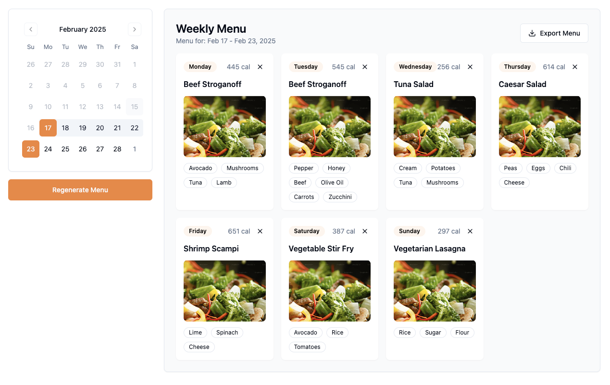

# Schedulicious 


## Overview
Schedulicious is a meal scheduling platform that allows managers to easily create different, allergy-conscious weekly menus for their employees. It automates scheduling, eliminating manual labour while maintaining diversity and inclusivity.



## Core Features
- **Automated Weekly Menu Generation**: Generates a weekly meal plan while ensuring no dish is repeated.
- **Manual Swap**: Easily swap meals for any day to adjust the schedule as needed.
- **Allergy-Aware Planning**: Automatically filters out dishes containing allergens based on saved user preferences.
- **Day Off Feature**: Mark specific days as non-working to exclude them from meal scheduling.
- **Export Options**: Download the meal plan as a PDF or Excel file for easy sharing.
- **Intuitive and Clean UI**: Designed for a seamless user experience with a clear and simple interface.

## Tech Stack
Schedulicious is built with the following technologies:
- **Frontend**: React, TypeScript
- **Routing**: React Router
- **State Management**: Zustand
- **UI Components**: ShadCN
- **Styling**: Tailwind CSS
- **Deployment**: Vercel


## Installation & Running Guide

### Prerequisites
- Node.js (v18 or higher)
- Yarn

### Getting Started

1. Install Dependencies
```bash
yarn install
```

2. Start Development Server
```bash
yarn dev
```
3. Open in Browser
- Visit http://localhost:3000 in your browser to view the app.

### Demo

If you prefer not to run the app locally, you can explore the live demo [here](https://schedulicious.vercel.app/).

## Contribution Guide

We welcome contributions! If you’d like to contribute:
1. Fork the repository.
2. Create a new branch for your feature or bug fix.
3. Make your changes and commit them.
4. Open a pull request, describing the changes you made.

For major changes, please open an issue first to discuss your ideas.

## Our Team
- **Chloe Zhou** (Developer): [GitHub](https://github.com/chloezhoudev) / [LinkedIn](https://www.linkedin.com/in/xyzhou-developer)
- **Nurul Mukhlisa** (UI/UX Designer): [GitHub](https://github.com/numulaa) / [LinkedIn](https://www.linkedin.com/in/nurul-mukhlisa/)